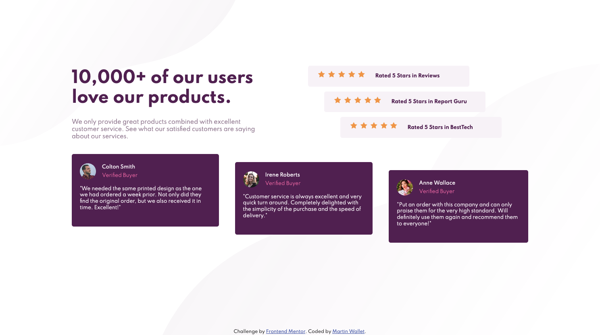

# Frontend Mentor - Social proof section solution

This is a solution to the [Social proof section challenge on Frontend Mentor](https://www.frontendmentor.io/challenges/social-proof-section-6e0qTv_bA). Frontend Mentor challenges help you improve your coding skills by building realistic projects. 

## Table of contents

- [Overview](#overview)
  - [The challenge](#the-challenge)
  - [Screenshot](#screenshot)
  - [Links](#links)
- [My process](#my-process)
  - [Built with](#built-with)
  - [What I learned](#what-i-learned)
  - [Continued development](#continued-development)
  - [Useful resources](#useful-resources)
- [Author](#author)


## Overview

### The challenge

Users should be able to:

- View the optimal layout for the section depending on their device's screen size

### Screenshot




### Links

- Solution URL: [GitHub](https://github.com/martinw0/social-proof)
- Live Site URL: [GitHub Pages](https://martinw0.github.io/social-proof/)

## My process

### Built with

- Semantic HTML5 markup
- CSS custom properties
- Flexbox
- Mobile-first workflow

### What I learned

Media queries for mobile
```
@media all and (max-device-width: 480px)
{
    /* Vos règles CSS pour les mobiles ici */
}
```

### Continued development


### Useful resources

- [Media queries](https://developer.mozilla.org/fr/docs/Web/CSS/Media_Queries/Using_media_queries)
- [CSS Selectors](https://www.w3schools.com/cssref/css_selectors.asp)

## Author

- Frontend Mentor - [@martinw0](https://www.frontendmentor.io/profile/martinw0)
- Twitter - [@leWalletM](https://www.twitter.com/leWalletM)